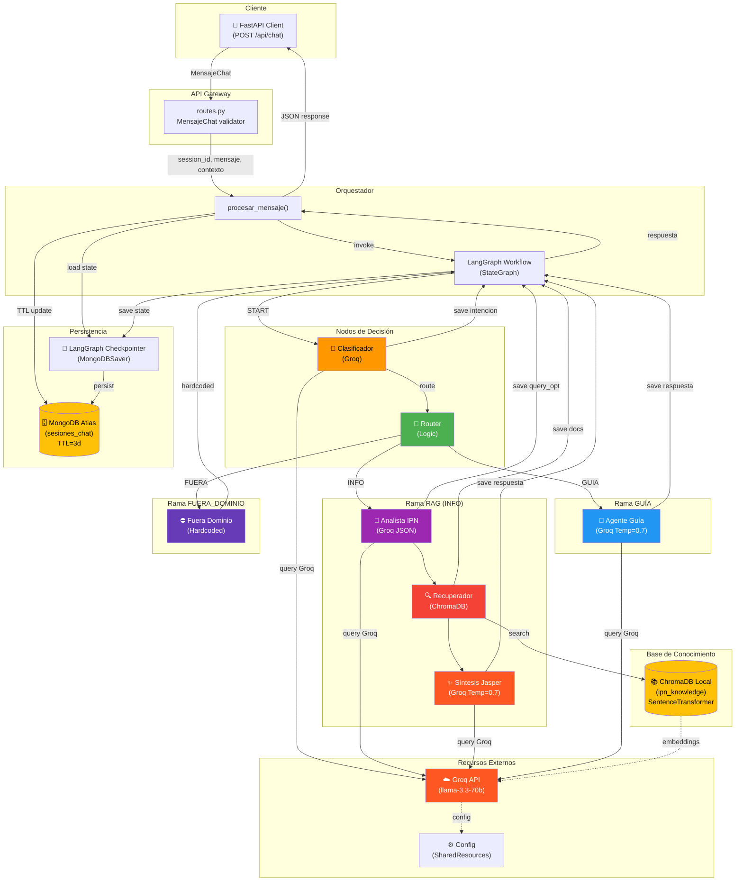
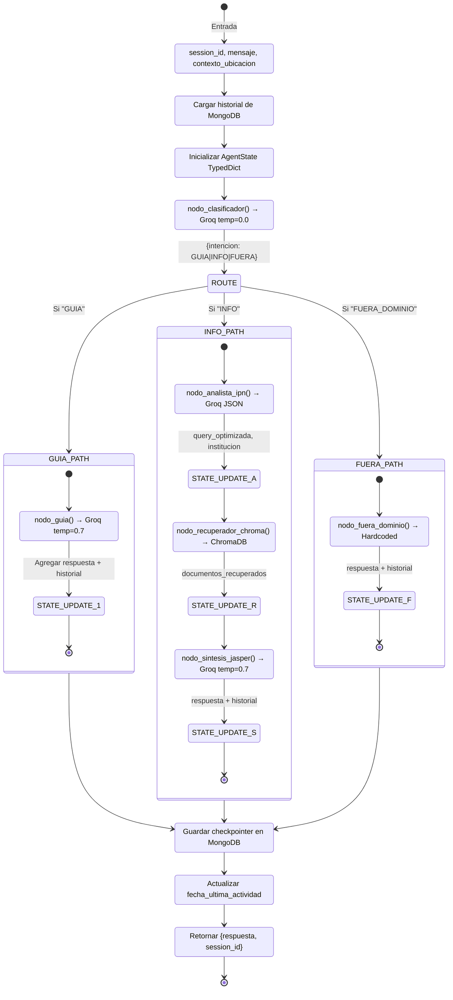
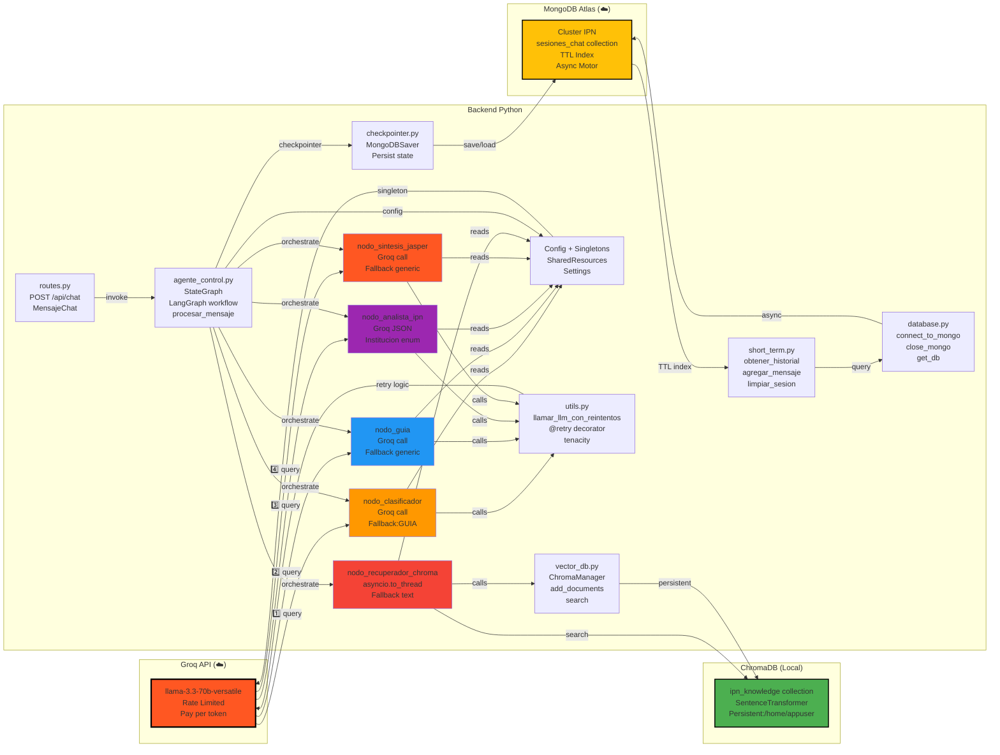
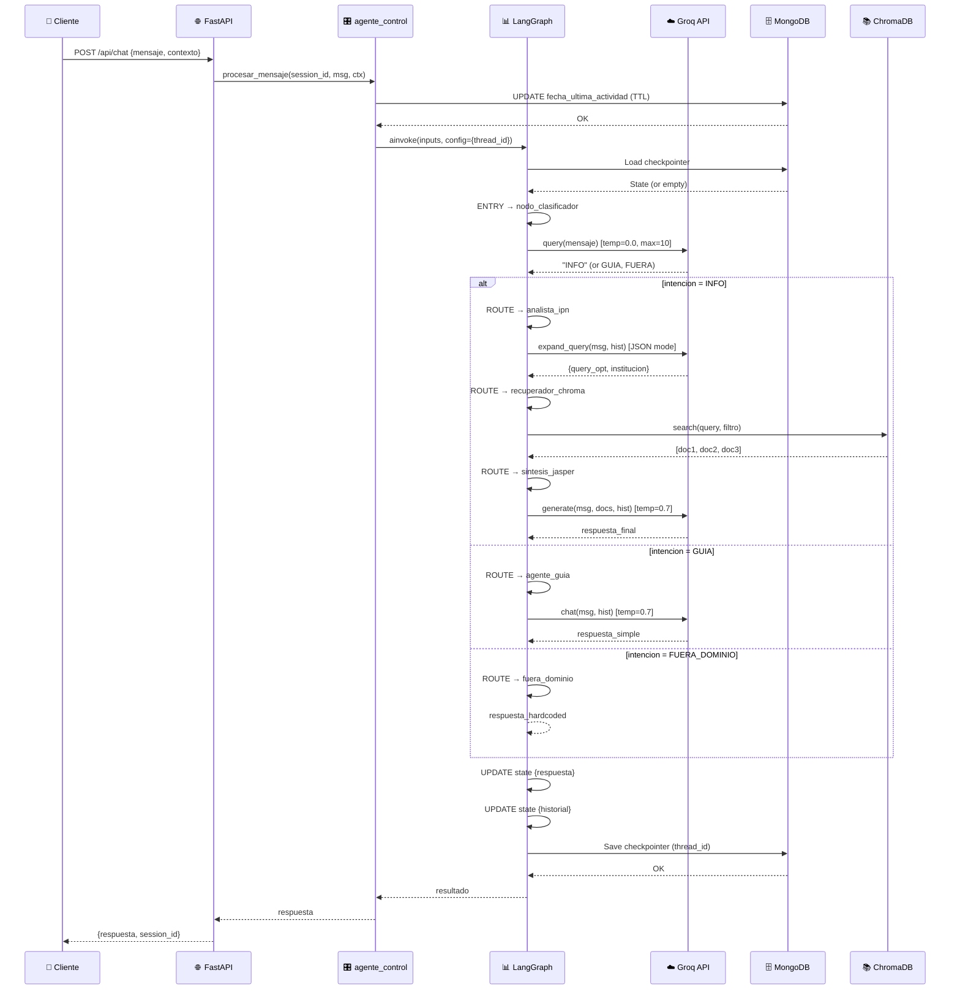
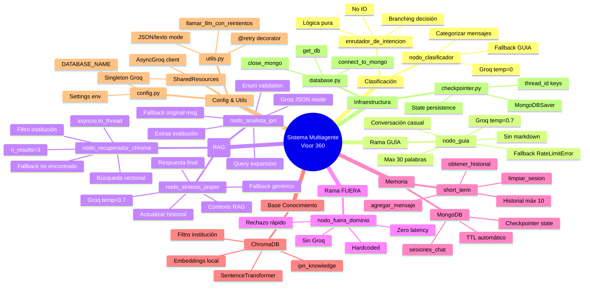
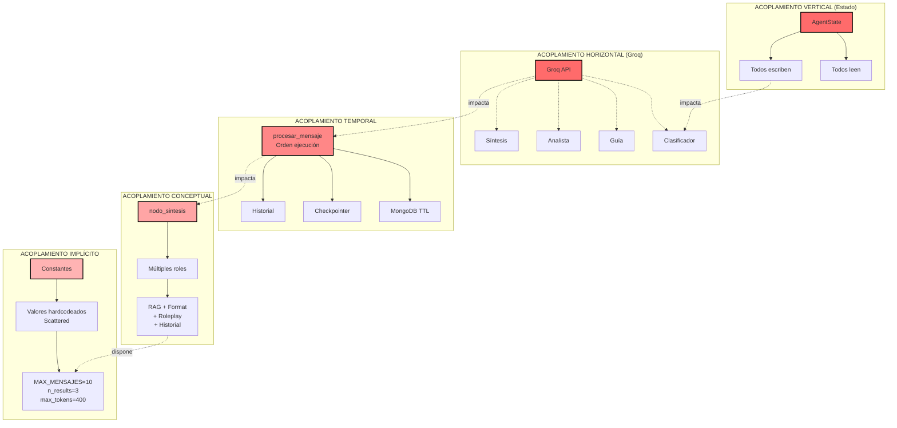
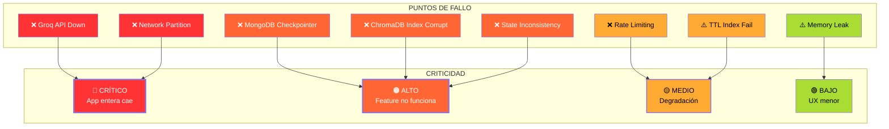
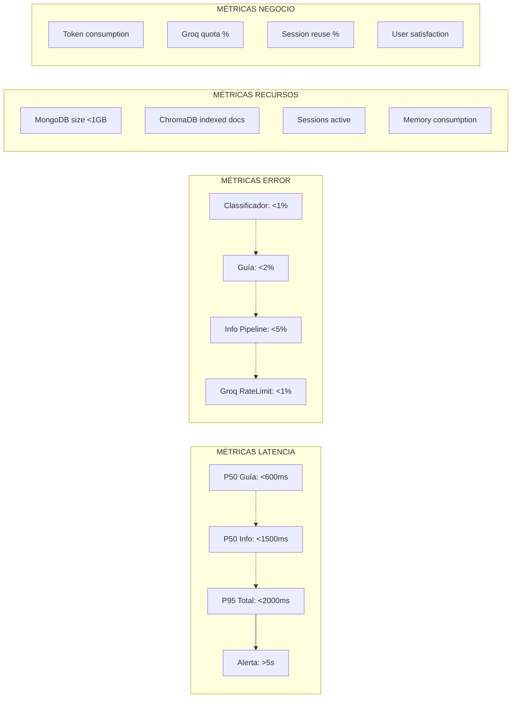

# DIAGRAMAS VISUALES - ARQUITECTURA MULTIAGENTE

## 1. DIAGRAMA DE COMPONENTES



---

## 2. DIAGRAMA DE FLUJO DE DATOS



---

## 3. DIAGRAMA DE DEPENDENCIAS



---

## 4. DIAGRAMA DE CICLO DE VIDA



---

## 5. MAPA DE RESPONSABILIDADES



---

## 6. TABLA DE FLUJOS

```
╔════════════════╦════════════════════╦════════════════════╦═══════════╦════════════╗
║ CAMINO         ║ NODOS              ║ LLAMADAS GROQ      ║ TIEMPO    ║ COSTO      ║
╠════════════════╬════════════════════╬════════════════════╬═══════════╬════════════╣
║ GUÍA           ║ Clasificador       ║ 2 calls            ║ ~800ms    ║ ~81 tokens ║
║ (simple)       ║ + Guía             ║ (temp=0.0, 0.7)    ║ (p50)     ║            ║
║                ║                    ║                    ║           ║            ║
║ FUERA_DOMINIO  ║ Clasificador       ║ 1 call             ║ ~200ms    ║ ~1 token   ║
║ (rápido)       ║ + Fuera            ║ (temp=0.0)         ║ (p50)     ║            ║
║                ║                    ║                    ║           ║            ║
║ INFO (RAG)     ║ Clasificador       ║ 4 calls            ║ ~1500ms   ║ ~191 tokens║
║ (completo)     ║ + Analista         ║ (0.0, 0.0 JSON,    ║ (p50)     ║            ║
║                ║ + Recuperador      ║ 0.0, 0.7)          ║           ║            ║
║                ║ + Síntesis         ║ + ChromaDB         ║           ║            ║
╠════════════════╬════════════════════╬════════════════════╬═══════════╬════════════╣
║ PROMEDIO       ║ Máximo 6 nodos     ║ 1-4 calls/request  ║ <2s       ║ ~150 tokens║
║ (SLA)          ║ Estado compartido   ║ MongoDB 2 ops      ║ target    ║ per req    ║
╚════════════════╩════════════════════╩════════════════════╩═══════════╩════════════╝
```

---

## 7. MATRIZ DE ACOPLAMIENTOS



---

## 8. CRÍTICO: MATRIZ DE FALLO



---

## 9. MONITOREO RECOMENDADO


